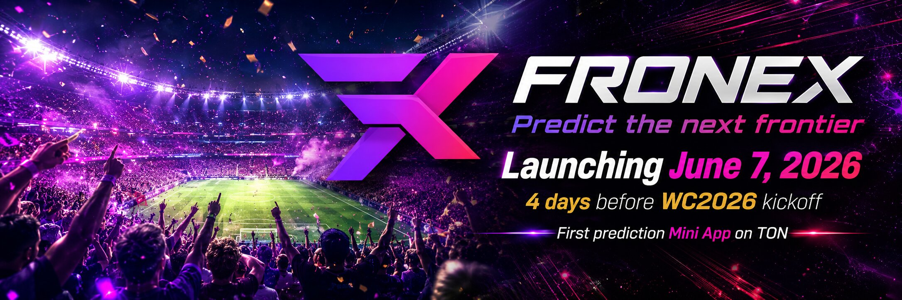

  

<h1 align="center">Fronex</h1>

<strong>Predict the next frontier.</strong>

Solo studio shipping the first Telegram-native prediction Mini App on TON, live for WC2026. 
Prediction infrastructure on TON · AI marketing tools for crypto founders · the operating system for community-owned prediction markets.

---

## Three products

| | What it is | Status |
|---|---|---|
| **fronex.fun** | Telegram-native prediction Mini App on TON. Five pillars: ⚽ soccer · 💰 crypto · 🎬 entertainment · 🌦️ climate · 🌐 community-custom. | Public launch **June 7, 2026** |
| **fronex.xyz** | Studio website + unified admin dashboard at `admin.fronex.xyz`. | Launches with fronex.fun |
| **fronex.bio** | AI marketing tool for crypto founders. Brand-safe content generation in 17 launch languages. | v0 internal · v1 public SaaS post-WC |

## WC2026 — the launch window

Fronex.fun ships into a **39-day live operations window** during WC2026 (Jun 11 – Jul 19). 104 matches, 5-source oracle redundancy, real-time price-history charts on every market, multi-outcome books, and a **Bracket Challenge** tournament with a $500 USDT seed prize pool. Free Round 1, $1 USDT Round 2.

## Repo strategy

**Open contracts, transparent process, closed product.** All repos are private today; visibility flips on milestones, not calendar dates.

| Repo | Today | Trajectory |
|---|---|---|
| `fronex.xyz` | Private | Goes **public** once the core public-site + admin implementation lands |
| `fronex-contracts` | *Not yet created* | Will be extracted from `fronex.fun/contracts/` and published **public** once Tact contracts are implemented + tested |
| `fronex.fun` | Private | Stays **private** — matching engine, oracles, sharded-treasury orchestration are the moat |
| `fronex.bio` | Private | Stays **private** — the AI tool *is* the v1 SaaS product |

Build-in-public is about **visible progress**: daily build logs, dev.to write-ups, on-chain auditable contracts (once they ship), the running product. Not a full-source dump.

## Find us

  
  
  

  
  
  
  

  
  

---

Built solo on TON. Predict the next frontier.

