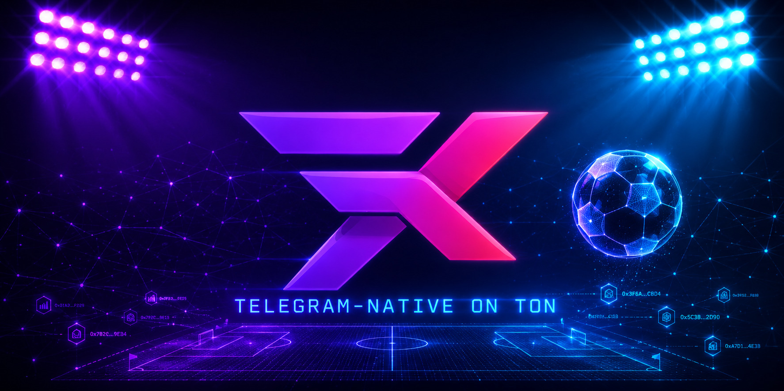

  

<h1 align="center">Fronex</h1>

<strong>Predict the next frontier.</strong>

Solo studio shipping the first Telegram-native prediction Mini App on TON, live for WC2026. 
Prediction infrastructure on TON · AI marketing tools for crypto founders · the operating system for community-owned prediction markets.

---

## Three products

| | What it is | Status |
|---|---|---|
| **fronex.fun** | Telegram-native prediction Mini App on TON. Five pillars: ⚽ soccer · 💰 crypto · 🎬 entertainment · 🌦️ climate · 🌐 community-custom. | **Live & public** since June 7, 2026 |
| **fronex.xyz** | Studio website + unified admin dashboard at `admin.fronex.xyz`. | **Live** with fronex.fun |
| **fronex.bio** | AI marketing tool for crypto founders. Brand-safe content generation. | v0 internal (live) · v1 public SaaS **Sep 1, 2026** |

## WC2026 — the launch window

Fronex.fun is live through the **39-day live operations window** of WC2026 (Jun 11 – Jul 19) — now in the **knockout stage** (Group Stage ran Jun 11–27; Round of 32 underway since Jun 28). 104 matches, multi-source oracle redundancy, real-time price-history charts on every market, multi-outcome books, and **Leagues** — community-run prediction tournaments over markets like the World Cup knockout rounds (free bragging-rights leagues for everyone; paid prize pools run by approved organizers).

## Repo strategy

**Open contracts, transparent process, closed product.** The public marketing site and the on-chain contracts are public; the product repos stay private. Visibility flips on milestones, not calendar dates.

| Repo | Visibility | Notes |
|---|---|---|
| `fronex.xyz` | **Public** | Public marketing site + admin — no product IP. Milestone met (live since Jun 7, 2026). |
| `fronex-contracts` | **Public (planned)** | Open-contracts policy — Tact source + tests + deployments to be extracted from `fronex.fun/contracts/` and published. Contracts are already live on TON mainnet (on-chain bytecode auditable since GA); the source-repo publication follows the audit/extraction milestone. |
| `fronex.fun` | Private | Stays **private** — matching engine, oracles, sharded-treasury orchestration are the moat |
| `fronex.bio` | Private | Stays **private** — the AI tool *is* the v1 SaaS product |

Build-in-public is about **visible progress**: daily build logs, dev.to write-ups, on-chain auditable contracts (live on TON mainnet since GA), the running product. Not a full-source dump.

## Find us

  
  
  

  
  
  
  

  
  

---

Built solo on TON. Predict the next frontier.

